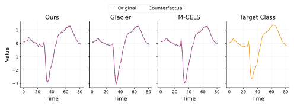
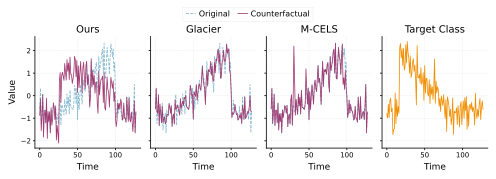

::: {.abstract}
We present a method for generating plausible counterfactual explanations (CFEs) for time series classification via gradient-based optimization in input space. Plausibility is enforced by aligning the generated CFE with $k$-nearest neighbors from the target class using soft-DTW — a differentiable relaxation of dynamic time warping. The optimization objective balances validity, proximity, sparsity, and the novel soft-DTW plausibility term. Across eight datasets, our method achieves perfect or near-perfect validity while outperforming baselines in distributional alignment with the target class by up to an order of magnitude in DTW distance.
:::

## Method

We seek a counterfactual $X'$ for a time series $X$ with predicted class $\hat{y} = f(X)$, targeting $y_{\text{target}} \neq \hat{y}$. The optimization objective is:

$$
\mathcal{L}_{\text{CF}} = \mathcal{L}_{\text{prox}} + \mathcal{L}_{\text{sparse}} + \lambda \cdot (\mathcal{L}_{\text{valid}} + \mathcal{L}_{\text{DTW}}),
$$

$$
\mathcal{L}_{\text{prox}} = \tfrac{1}{dT}\|X' - X\|_2^2, \qquad
\mathcal{L}_{\text{sparse}} = \tfrac{1}{dT}\|X' - X\|_1,
$$

$$
\mathcal{L}_{\text{valid}} = \max\!\left(0,\, \tau - p_f(y_{\text{target}} \mid X')\right), \qquad
\mathcal{L}_{\text{DTW}} = \frac{1}{k}\sum_{Y \in \mathcal{N}_k(X,\, y_{\text{target}})} \text{DTW}^\gamma(X', Y).
$$

**Soft-DTW** [@Cuturi2017SoftDTW] replaces the hard minimum in standard DTW with a smooth approximation parameterized by $\gamma > 0$, making the alignment cost differentiable with respect to $X'$. The plausibility term $\mathcal{L}_{\text{DTW}}$ pulls $X'$ toward the $k$ nearest target-class training examples, encouraging realistic temporal structure rather than adversarial perturbations. We optimize $X'$ by gradient descent with classifier weights frozen. Defaults: $\lambda = 1$, $k = 10$, $\gamma = 1$.

## Qualitative Results

The figures below compare counterfactuals produced by our method, Glacier [@Wang2024], and M-CELS [@li2024mcels].

On **TwoLeadECG**, both our method and M-CELS capture the prominent target-class peak; Glacier produces subtle changes that miss it entirely.

{width=99% fig-align="center"}

The contrast is sharper on **CBF** — three geometrically distinct classes (Cylinder, Bell, Funnel). Our method produces a CFE that clearly adopts the target shape. Glacier and M-CELS generate perturbations that resemble adversarial noise rather than meaningful class transformations.

{width=99% fig-align="center"}

## Quantitative Results

Evaluated on eight UCR/UEA datasets [@Dau2019UCR] against Glacier [@Wang2024] (univariate only) and M-CELS [@li2024mcels]. **Metrics:** Validity ($\text{Val}\uparrow$), $L_1$/$L_2$ distance ($\downarrow$), average DTW to 10 nearest target-class neighbors ($\downarrow$), Isolation Forest Score ($\uparrow$).

| Dataset | Method | $\text{Val}\uparrow$ | $L_1\downarrow$ | $L_2\downarrow$ | $\text{DTW}\downarrow$ | Iso Forest$\uparrow$ |
|---|---|---|---|---|---|---|
| **CBF** | **Ours** | **1.000** | 9.871 | 1.071 | **0.194** | **1.000** |
| | Glacier | 0.360 | 4.062 | 0.540 | 1.415 | 0.987 |
| | M-CELS | 0.226 | **1.500** | **0.486** | 2.402 | 0.984 |
| **TwoLeadECG** | **Ours** | **1.000** | 1.446 | 0.214 | **0.016** | **1.000** |
| | Glacier | 0.233 | 0.484 | **0.115** | 0.064 | **1.000** |
| | M-CELS | 0.970 | **0.245** | 0.119 | 0.302 | 0.879 |
| **GunPoint** | **Ours** | **0.975** | 4.478 | 0.491 | **0.155** | **1.000** |
| | Glacier | 0.000 | 0.639 | 0.170 | 0.436 | **1.000** |
| | M-CELS | 0.425 | **0.129** | **0.074** | 2.317 | 0.925 |
| **Earthquakes** | **Ours** | **1.000** | 48.985 | 2.441 | **0.775** | 0.924 |
| | Glacier | 0.000 | 8.528 | **0.661** | 1.907 | **1.000** |
| | M-CELS | 0.174 | **6.765** | 1.167 | 0.288 | **1.000** |
| **Coffee** | **Ours** | **1.000** | 5.979 | 0.489 | **0.064** | **1.000** |
| | Glacier | 0.455 | 9.182 | 0.795 | 1.024 | **1.000** |
| | M-CELS | **1.000** | **0.527** | **0.183** | 0.423 | 0.636 |
| **ItalyPowerDemand** | **Ours** | **1.000** | 0.869 | 0.222 | **0.015** | **1.000** |
| | Glacier | 0.023 | 0.307 | 0.107 | 0.054 | **1.000** |
| | M-CELS | 0.466 | **0.178** | **0.091** | 0.369 | 0.831 |
| **Cricket** | **Ours** | **1.000** | 475.900 | 12.210 | **0.810** | **0.972** |
| | Glacier | N/A | N/A | N/A | N/A | N/A |
| | M-CELS | 0.194 | **54.403** | **2.636** | 65.924 | 0.888 |
| **Epilepsy** | **Ours** | **1.000** | 68.130 | 3.138 | **3.445** | **1.000** |
| | Glacier | N/A | N/A | N/A | N/A | N/A |
| | M-CELS | 0.272 | **14.807** | **1.623** | 19.213 | **1.000** |

: {.striped}

Our method achieves perfect or near-perfect validity on all datasets and the best DTW plausibility score everywhere — often by an order of magnitude (e.g. 0.016 vs. 0.302 on TwoLeadECG; 0.810 vs. 65.924 on Cricket). The higher $L_1$/$L_2$ values reflect an inherent trade-off: enforcing temporal realism requires larger, more structured modifications than simply minimizing perturbation magnitude.

## Conclusions

Explicit soft-DTW alignment with target-class neighbors is a simple and effective mechanism for producing plausible time series counterfactuals. It delivers near-perfect validity and substantially better distributional alignment than existing methods, at the cost of larger perturbations — confirming that meaningful temporal realism requires more structured changes than proximity-minimizing methods admit.

---

*Supported by the National Science Centre (Poland), Grant No. 2024/55/B/ST6/02100.*

## References

::: {#refs}
:::
